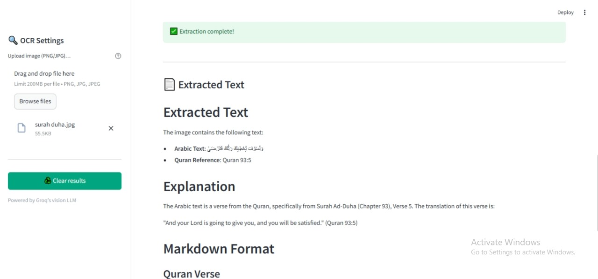

# 🧾 GroqVision Streamlit App

A sleek, interactive Streamlit application that lets you:

1. **Upload an image** (receipts, certificates, photos, scanned docs, etc.)  
2. **Extract all readable text** via Groq’s vision-capable LLM, rendered as structured Markdown  
3. **Download** the raw Markdown transcript of your OCR results  



---

## 🚀 Features

- **Image OCR**  
  - Extracts text from any PNG, JPG or JPEG image  
  - Returns headings, lists, code blocks—perfectly formatted in Markdown  
- **Visual Q&A**  
  - Ask arbitrary questions about your image (e.g. “What does this document certify?”, “Who signed it?”, “Describe the layout.”)  
  - Receive concise, context-aware answers  
- **Clean, responsive UI**  
  - Full-width image preview  
  - Animated progress bar and success feedback  
  - Custom CSS styling for a polished look  
- **Downloadable output**  
  - Get the raw Markdown via a “Download” button  
  - Keep a permanent record of your OCR sessions  

---

## 🛠️ Tech Stack

- **Framework**: [Streamlit](https://streamlit.io/)  
- **Vision LLM**: [Groq Chat API](https://console.groq.com/) (vision-capable models)  
- **Image handling**: [Pillow](https://python-pillow.org/)  
- **Styling**: Custom CSS injected into Streamlit  

---

## 📦 Installation

1. **Clone this repo**  
   ```bash
   git clone https://github.com/Noor-Fatima-Afzal/groqvision-ocr-qa.git
   cd groqvision
